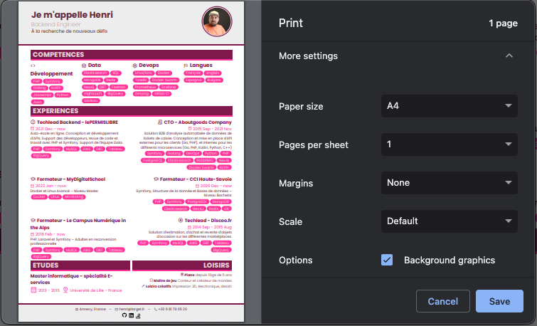

CV 2023
==================

## Description

A CV generator using svelte, tailwind and daisyUI

## Usage

```bash
yarn
yarn dev
```

or with docker :

```bash
docker compose run node yarn
docker compose up -d
```

Then visit the url given by the console (default to localhost:5173 )

Then you can **print** the page as a PDF.

Protip: When printing, enable Background graphics to have the background colors, and set the margins to none.



## Customize

### Content

The content of all the CV is in src/assets/data/ and some translations (titles and labels) are in
src/assets/translations/

The `*Fallback.json` is the main file, and if you want to customize in different languages, you can change the language
in the `.env` file and override the content in a `*LANG.json` version of the file.

### Colors and themes

I use DaisyUI for the colors and themes, so you can customize the colors in the `tailwind.config.js` file.
You can also check the [DaisyUI documentation](https://daisyui.com/docs/themes/) for more information.

### More social icons

To add more support of social icons, you can add them in the `src/assets/icons/icons.js` file.
I used the fontawesome SVG provided versions for github, linkedin and stackoverflow.

### General Layout

Edit the file src/Layout.svelte to change the order of every blocks.
If you need to change sizes there are in the `src/components/` folder or in the app.css for the more general ones.

## Resources

for icons :
[Google Material icons](https://fonts.google.com/icons?selected=Material+Symbols+Outlined:receipt_long:FILL@0;wght@500;GRAD@0;opsz@48)